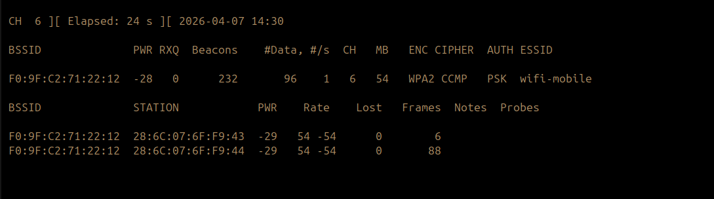
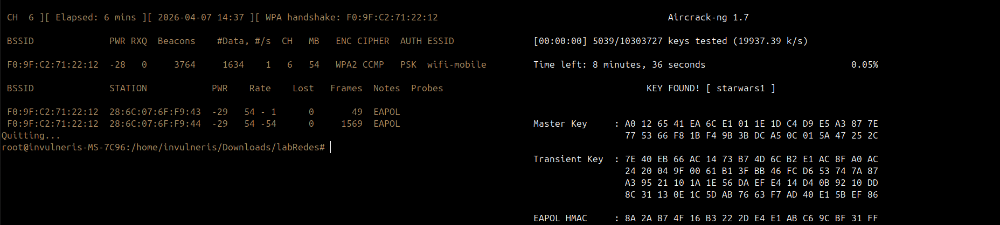

## Language

- English (default)
- Portuguese: [README.pt-BR.md](README.pt-BR.md)

# Wi-Fi Security Analysis (WPA2)

## Objective
This project evaluates the security of Wi-Fi networks using the WPA2-PSK protocol in a controlled and authorized environment.

## Environment
- Controlled laboratory
- Authorized test network
- Traffic analysis tools

## Network Identification
A network with the following characteristics was identified.

The image below shows the network discovery and monitoring process:

- Protocol: WPA2
- Cipher: CCMP
- Authentication: PSK
- Channel: 6
- Active traffic observed
- Connected clients present

## Handshake Capture
Analysis revealed the presence of EAPOL packets, confirming that the WPA2 handshake was successfully captured.

## Security Analysis
The captured handshake enables offline dictionary-based attacks.  
In this scenario, the network was vulnerable due to insufficient password complexity.

## Limitations
- Requires connected clients
- Dependent on signal quality
- Ineffective against strong passwords

## Analysis Result
The image below demonstrates the successful capture of the handshake and the validation of the network's exposure:

The results indicate that the network is susceptible to dictionary-based attacks when weak passwords are used.

## Mitigations
- Use strong passwords (minimum 12 characters with high entropy)
- Adopt WPA3 where possible
- Disable WPS
- Monitor deauthentication events

## Key Insight
WPA2 security primarily depends on password complexity rather than the protocol itself.

## Ethics
This project was conducted in a controlled and authorized environment for educational purposes only.

## Author
João Carlos Velho de Oliveira.
